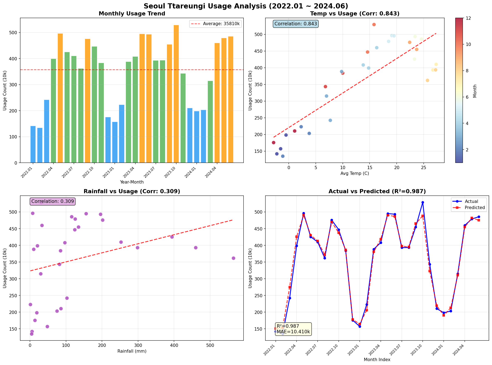

# 서울 따릉이 이용량과 기상 데이터 상관관계 분석

##  ▶ 시작 계기

- 서울 시민들이 따릉이를 얼마나 이용하고 있을까?
- 날씨가 이용량에 얼마나 영향을 줄까?
- 비 오는 날과 맑은 날 차이가 얼마나 날까?

이 질문들에서 출발해서 따릉이 이용 데이터와 기상 데이터를 직접 수집해 분석했습니다.

---

## ▶ 프로젝트 개요

- **분석 기간:** 2022년 1월 ~ 2024년 6월 (30개월)
- **개발 환경:** Python 3.11 / Jupyter Notebook
- **사용 데이터:** 서울시 공공자전거 이용정보 + 기상청 기온·강수량

---

## ▶ 사용 데이터

| 데이터 | 출처 | 기간 |
|--------|------|------|
| 따릉이 월별 이용정보 | 서울 열린데이터 광장 | 2022.01 ~ 2024.06 |
| 월별 평균기온 | 기상자료개방포털 | 2022.01 ~ 2024.06 |
| 월별 강수량 | 기상자료개방포털 | 2022.01 ~ 2024.06 |

---

## ▶ 분석 과정

### 1. 데이터 수집 및 전처리
- 따릉이 CSV 파일 13개 병합
- 파일별 컬럼명 불일치 통일 처리
- 날짜 형식 통일 (YYYYMM)
- 기상 데이터와 월별 기준으로 병합

### 2. 탐색적 데이터 분석 (EDA)
- 월별 이용건수 추이 시각화
- 기온·강수량과 이용량 상관관계 분석

### 3. 예측 모델 구축
- 사용 모델: RandomForest Regressor
- 입력 변수: 평균기온, 강수량, 월
- 평가 지표: R², MAE

---

## ▶ 분석 결과



### 상관관계 분석

| 변수 | 상관계수 | 해석 |
|------|---------|------|
| 평균기온 | **0.843** | 매우 강한 양의 상관관계 |
| 강수량 | 0.309 | 약한 양의 상관관계 |

### 예측 모델 성능

| 지표 | 값 |
|------|-----|
| R² | **0.987** |
| MAE | 103,964건 |

### 기초 통계

| 항목 | 값 |
|------|-----|
| 월평균 이용건수 | 3,575,620건 |
| 최대 이용건수 | 5,293,193건 (2023년 10월) |
| 최소 이용건수 | 1,349,352건 (2022년 2월) |

---

## ▶ 핵심 인사이트

1. **기온이 이용량의 핵심 변수** — 상관계수 0.843으로 기온이 높을수록 이용량이 크게 증가
2. **비보다 추위가 더 문제** — 강수량(0.309)보다 기온(0.843)이 이용량에 훨씬 강한 영향
3. **10월이 최대 이용 시즌** — 선선한 날씨로 인해 매년 10월에 최대 이용량 기록
4. **겨울과 가을 이용량 차이 약 4배** — 1~2월 대비 10월 이용량이 약 4배 높음
5. **기상 데이터만으로 98.7% 설명 가능** — R² 0.987로 기온·강수량·월 정보만으로 이용량 예측 가능

---

## ▶ 한계점 및 개선 방향

분석을 마치고 나서 아쉬웠던 점들도 있었습니다.

- 기상 데이터가 2024년 6월까지만 확보되어 분석 기간이 제한됨
- 미세먼지, 공휴일, 대여소 신설 등 추가 변수를 반영하지 못함
- 대여소별 지역적 특성은 이번 분석에서 다루지 않음
- 향후 시계열 모델(SARIMA 등)을 적용하면 예측 정확도를 더 높일 수 있을 것으로 판단

---

## ▶ 기술 스택

- **언어:** Python 3.11
- **분석:** pandas, numpy
- **시각화:** matplotlib
- **모델링:** scikit-learn (RandomForestRegressor)
- **환경:** Jupyter Notebook

---

## ▶ 파일 구조

```
ttareungi-analysis/
├── analysis.ipynb          # 전체 분석 코드
├── ttareungi_analysis.png  # 분석 결과 시각화
├── README.md               # 프로젝트 설명
└── data/                   # 원본 데이터 (CSV)
```
